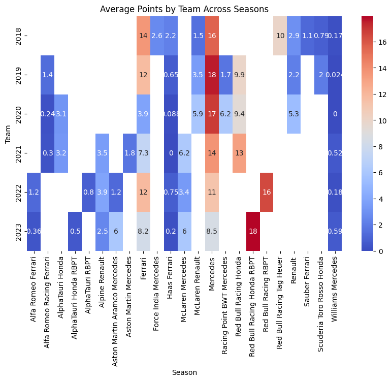
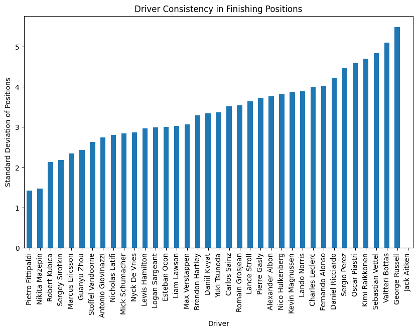
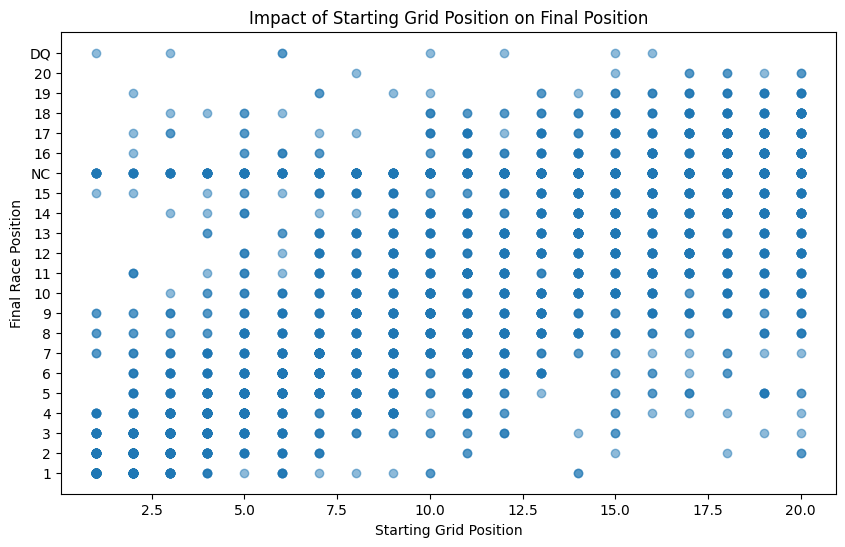
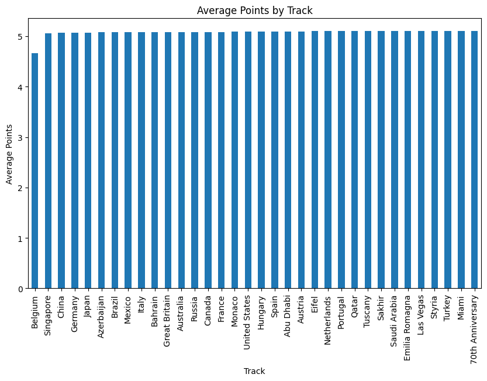
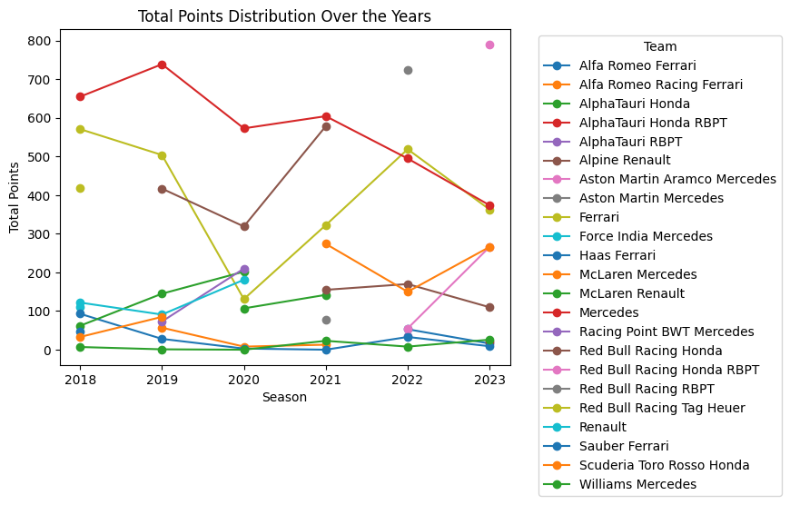

# Formula One Analysis Datascience Fundamentals Individual Project
## Introduction
Formula One is an ever growing sport as the popular Netflix series [Drive to Survive](https://www.netflix.com/title/80204890) is a big hit and with the introduction of more races in [North America](https://www.redbull.com/us-en/f1-races-hosted-us-tracks) more and more people are getting into it, I would like to take this opportunity to analyze the correlation between teams, drivers and tracks from the past 5 season from 2018 to 2023. 
## Data Selection
I will be primarily utilize provided CSV files from the internet as well as websites that consist of statistics regarding the drivers, team and tracks. To make sure these dataset is reliable I will double check with the official [Formula 1](https://www.formula1.com/en/results.html/2024/races.html) Results website. 

The code to read and minipulate the CSV files can be found withitn the github repository [here]() using Google Collabatory

## Methods
I will primarily be using the utility learnt in class to read and manipulate the data for my findings.
* `numpy`
  
In regards to visualization I will be using
* `Pandas`
* `Matplotlib`
* `SciKit`
## Questions That will be asked
Question 1: How has the performance of teams evolved over the seasons? 

Question 2: Which drivers have shown the most consistency in race positions?

Question 3: What impact do starting grid positions have on final race outcomes?

Question 4: How do track characteristics influence race outcomes?

Question 5: What are the patterns in points allocation over the years?

## Results and Discussion
Question 1: We took a look over the performance of the teams that has evolved over the season although some of the teams went through rebranding we can also see that there is three teams that has remained the not rebranded over the course of the five years that is analyzed, it was Ferrari and Mercedes and Williams

Question 2: We took a look at the driveres that shown the msot consistency in their race position, as the standard deviation is lower it means they are more consistent as their finishing position is closest to their starting position, this however can be an outlier as some drivers may have issues in qualifying and have a lower starting position but finish higher by the end of the race.

Question 3: In correlation to the previous question we will take a look into the more specific position of where the drivers qualify for has the highest impact. We can see that drivers who start at the top 10 position have to post impact since points are only allocated to the top 10.

Question 4: Taking a look at track characteristics and points distribution most of the track have normal readings as points are consistent through the five years of regulation however, during the Belgium Grand Prix there is weather issue where the race had to be ended early therefore there is an outlier. 

Question 5: Taking a look at the patterns of points of the teams over the years we can conclude that there is three types of teams, the top teams, the mid-fielders and the bottom teams. We can see the top teams, Ferrari, Mercedes and Redbull are always consistent while mid-field teams have fluctuation in their points distribution and bottom means are consistent as well but in the sense of not score points.

## Coding
Here I will put all my .ipynb files which will consit of the codes used for reading and manipulating the CSV datas.
## References
https://www.statista.com/statistics/263093/topr-formula-1-manufacturers-based-on-number-of-world-titles/
https://www.kaggle.com/datasets/petalme/f1-drivers-dataset
https://www.kaggle.com/datasets/debashish311601/formula-1-official-data-19502022 

